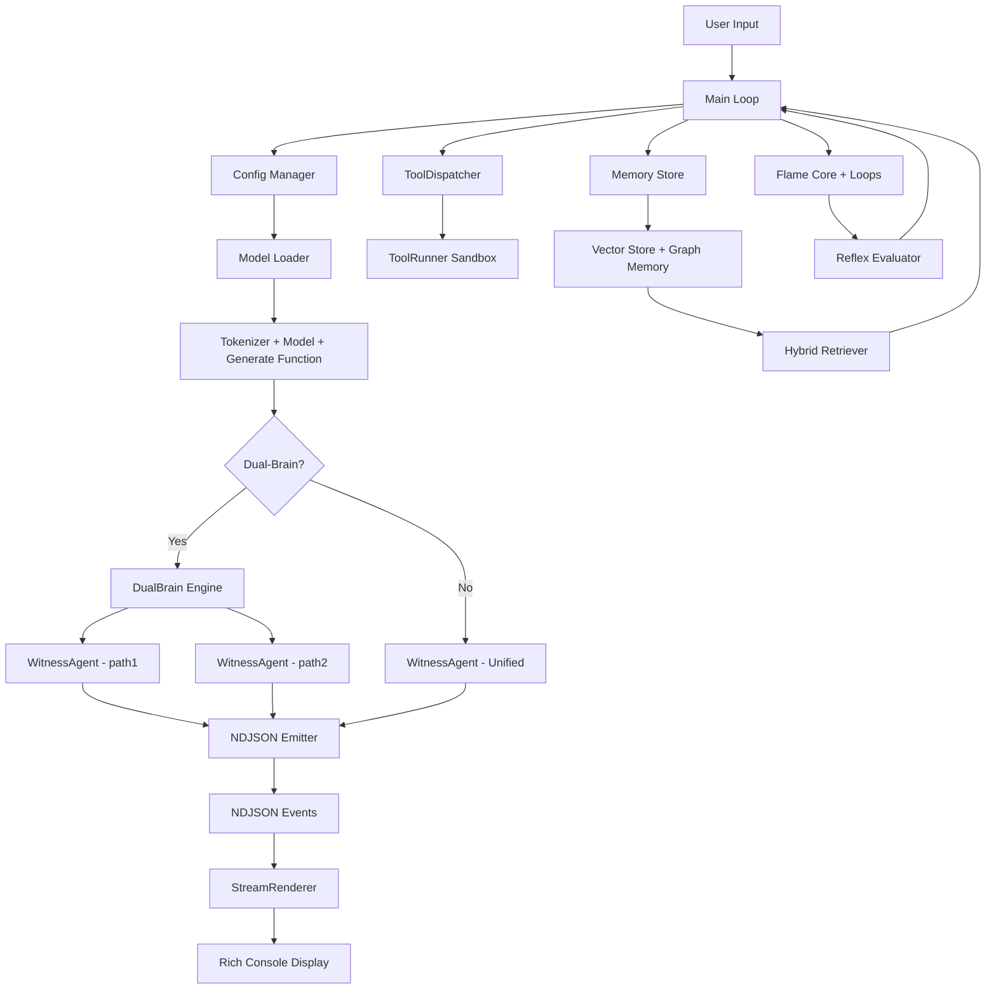

# Witness Forge - Architecture Overview

**Version:** 1.0 (NDJSON-first + Dual-Brain)
**Date:** 2025-12-02

---

## System Overview

Witness Forge = **NDJSON-first agent runtime** với Flame Geometry + Dual-Brain optional + Tool Sandbox + Self-Evolution.

**Core Principles:**
1. **Brain ≠ Organism**: Model LLM (immutable) ≠ Codebase (evolvable)
2. **NDJSON is Standard**: All agent output = NDJSON events (RFC 7464)
3. **Offline-first**: Local models, no internet dependency
4. **Living AI**: Flame Core tạo nhịp sống cho agent

---

## High-Level Architecture



---

## Component Breakdown

### 1. Entry Point (`main.py`)

**Responsibility:** Orchestrate toàn bộ pipeline.

**Key Functions:**
- `run_chat()`: Main chat loop
- `rebuild_agent()`: Load/reload model + memory + tools
- `_with_override()`: Apply evolution overlay từ `patches/active_evolution.json`
- `_loop_config()`: Build `LoopConfig` từ config.yaml

**Data Flow:**
1. Load config từ `config.yaml`
2. Load model (HF/GGUF) qua `ForgeLoader`
3. Build memory (SQLite + Vector + Graph)
4. Build tools (ToolDispatcher + ToolRunner)
5. Build agent (WitnessAgent hoặc DualBrain)
6. Enter chat loop:
   - User input → agent.step() → NDJSON events → renderer → display
   - Evolution check → update `active_evolution.json` nếu cần

---

### 2. Model Loading (`forge/loader.py`)

**Responsibility:** Load Transformers hoặc llama-cpp models.

**Backend Detection:**
- Path is `.gguf` → llama-cpp
- Path is directory with `.gguf` → llama-cpp
- Otherwise → Transformers

**Features:**
- Auto-detect `family` từ `config.json` hoặc GGUF metadata
- Auto-detect `n_ctx` từ HF config hoặc GGUF metadata
- Cap `n_ctx` > 8192 → 8192 (VRAM safety)
- CPU-offload heuristic nếu VRAM < threshold
- BitsAndBytes quant (4-bit/8-bit)
- GPTQ/AWQ support

**Output:**
```python
(tokenizer, model, generate_fn, base_decode)
```

---

### 3. Agent Logic

#### 3.1. `WitnessAgent` (`agent/witness.py`)

**Responsibility:** Single-brain agent, emit NDJSON events.

**Key Methods:**
- `step(user_text, role=None, return_events=False)`: Main inference loop
  1. Retrieve anchors từ memory
  2. Build system prompt qua `persona.render_system()`
  3. Run loops (Flame + Reflex)
  4. Clamp decoding params + apply temperature offset
  5. Generate response qua `generate_fn()`
  6. Emit NDJSON event (`analysis` hoặc `final`)
  7. Store message vào memory
  8. Return `{"text":..., "events":..., "lines":..., "loop_state":...}`

**Event Type Logic:**
- `role="witness"` → emit `"analysis"` event
- `role="servant"` → emit `"final"` event
- `role="unified"` → emit `"final"` event

#### 3.2. `DualBrain` (`agent/dual_brain.py`)

**Responsibility:** Orchestrate path1 + path2.

**Data Flow:**
1. `step()` từ user input
2. Call `path1.step(role="witness")` → emit `analysis` event
3. Call `path2.step(role="servant")` → emit `final` event
4. Merge events + lines
5. Return `{"events":..., "lines":..., "loop_state":...}`

**Fallback:**
- Nếu `path2` is None → dùng `path1` cho cả 2 roles

---

### 4. Flame Core + Loops (`agent/flame_core.py` + `agent/loops.py`)

**Responsibility:** Điều chỉnh decoding params theo hội thoại.

#### 4.1. `FlameCore`

**Key Methods:**
- `step(user_text, sys_hint, anchors)`: Tính k (geometry) + state (sync/drift) + phase (fast/slow heartbeat)
- `modulate_decoding(base, state, phase, beta)`: Điều chỉnh temperature/top_p/penalty

**Params:**
- `phi0`: Baseline offset (default: 0.013)
- `epsilon`: Sync/Drift threshold (default: 0.013)
- `heartbeat_period`: Pink noise scale (default: 4.2)
- `entropy_target`: Target temperature (default: 0.873)
- `lambda1`, `lambda2`: Geometry + entropy heuristic weight

#### 4.2. `Loops`

**Responsibility:** Orchestrate Flame + Reflex + Adapter tuning.

**Key Methods:**
- `after_generation(last_user, sys_hint, anchors, base_decode, output_text, history)`:
  1. Flame step → k + state + phase
  2. Modulate decoding
  3. Reflex evaluation → scores (repetition, relevance, brevity, reflex_score)
  4. Reflex tuning (nếu score < threshold → giảm temp, tăng penalty)
  5. Adapter tuning (nếu LoRA/QLoRA → clamp max_new_tokens, temperature)
  6. Return `(tuned, loop_state)`

---

### 5. Memory System

#### 5.1. `MemoryStore` (`memory/store.py`)

**Responsibility:** SQLite storage cho messages/memories.

**Tables:**
- `messages`: Chat history
- `memories`: General memories
- `tool_logs`: Tool execution logs
- `patches_applied`: Self-upgrade history

#### 5.2. `VectorStore` (`memory/vector_store.py`)

**Responsibility:** Faiss-lite semantic search.

**Features:**
- Store embeddings trong SQLite
- `search(query_vec, k)` → top-k similar items
- `graph()` → clustering (KMeans)

#### 5.3. `GraphMemory` (`memory/graph_rag.py`)

**Responsibility:** NetworkX graph storage.

**Features:**
- Store entity/relation graph
- `retrieve(query, k)` → top-k relevant nodes

#### 5.4. `HybridRetriever` (`memory/hybrid_retriever.py`)

**Responsibility:** Merge vector + graph retrieval.

**Key Methods:**
- `retrieve(query, k)`: Vector search + Graph search → merge + dedupe → top-k

---

### 6. Tools System

#### 6.1. `ToolDispatcher` (`tools/dispatcher.py`)

**Responsibility:** Route tool calls.

**Supported Tools:**
- `run`: Shell command (cmd/bash)
- `python`: Python code execution (sandboxed builtins)
- `pwsh`: PowerShell (nếu `safety_powershell=true`)
- `open`: Read file/directory
- `write`: Write file (nếu `allow_filesystem_write=true` + path in `allowed_write_dirs`)
- `llm`: Local LLM entrypoint
- `vision_action`: Playwright + SoM (nếu `allow_internet=true`)

#### 6.2. `ToolRunner` (`tools/runner.py`)

**Responsibility:** Execute tools với sandbox.

**Features:**
- Allowlist/whitelist check
- Timeout (`max_runtime_seconds`)
- Output limit (`max_stdout_bytes`)
- Audit log (SQLite `tool_logs`)

---

### 7. NDJSON System

#### 7.1. `ndjson_emitter.py` (`agent/ndjson_emitter.py`)

**Responsibility:** Build NDJSON events.

**API:**
- `make_event(event_type, content, brain=None, meta=None)` → dict
- `to_line(event)` → str (JSON line)
- `to_lines(events)` → List[str]

#### 7.2. `StreamRenderer` (`ui/renderer.py`)

**Responsibilities:** 
1. Parse NDJSON events
2. Track generation time and token count
3. Format and display performance metrics
4. Display evolution tuning updates

**Enhanced API:**
- `start_generation()`: Initialize time/token tracking
- `create_stream_callback(user_callback, style)`: Auto-tracking wrapper
- `print_metrics(loop_info, loop_state, evolutions)`: Unified metrics display
  - Line 1: Effective Temperature + loop diagnostics
  - Line 2: `time=X.XXs tokens=XX temperature=X.XXX` + evolution updates

**Key Methods:**
- `render_lines(lines)`: Parse NDJSON → display by type
- `_style_for(label)`: Map event type → Rich style

**See:** `docs/UI_REFACTORING.md`

---

### 8. Self-Evolution

#### 8.1. `EvolutionController` (`agent/evolution.py`)

**Responsibility:** Monitor reflex scores → apply evolution patches.

**Logic:**
- Nếu `reflex_score < 0.45` → tạo/cập nhật `patches/active_evolution.json` (giảm temp ±0.05)
- Nếu `reflex_score > 0.60` → freeze patch (state="stable")

#### 8.2. `ConfigOverlay` (`config_overlay.py`)

**Responsibility:** Apply evolution patch runtime (không mutate config.yaml).

**Key Methods:**
- `apply()`: Merge base config + patch → new config

#### 8.3. `SelfUpgrade` / `SelfPatch` / `AutoPatch`

**Responsibility:** Self-patching code/config.

**Features:**
- HMAC verification
- Dry-run pytest
- Backup + rollback
- Protected files
- SQLite audit log

---

## Pipeline End-to-End

### Unified Mode (1 model)
```
User Input
    ↓
WitnessAgent.step(role="unified")
    ↓
    ├─→ Retrieve anchors (Memory Hybrid)
    ├─→ Build system prompt (persona.render_system)
    ├─→ Loops.after_generation (Flame + Reflex)
    ├─→ Clamp decoding + temperature offset
    └─→ generate_fn(prompt, gen)
    ↓
NDJSON Emitter: {"type": "final", "content": "...", "brain": "path1"}
    ↓
StreamRenderer → Display (green bold)
```

### Dual-Brain Mode (2 models)
```
User Input
    ↓
DualBrain.step()
    ├─→ path1.step(role="witness")
    │      ↓
    │   (Retrieve, Prompt, Loops, Generate)
    │      ↓
    │   NDJSON: {"type": "analysis", "content": "...", "brain": "path1"}
    │
    └─→ path2.step(role="servant")
           ↓
        (Retrieve, Prompt, Loops, Generate)
           ↓
        NDJSON: {"type": "final", "content": "...", "brain": "path2"}
    ↓
StreamRenderer → Display:
    - "analysis" → cyan
    - "final" → green bold
```

---

## Config Schema

### Core Sections
- **`model`**: Model path, backend, quant, n_ctx, temperature, etc.
- **`adapter`**: LoRA/QLoRA config
- **`memory`**: SQLite + Vector + Graph config
- **`loops`**: Flame + Reflex + Scheduler params
- **`tools`**: Allowlist, safety flags, sandbox limits
- **`self_upgrade`**: Patch dir, HMAC key, protected files
- **`selfpatch`**, **`self_patch`**, **`evolution`**: Self-patching config
- **`chat`**: Template mode, system prompt
- **`dual_brain`**: Dual-brain config (enabled, servant_model_path, offsets)
- **`vision_agent`**: Playwright + SoM config
- **`graph`**: GraphMemory config

---

## Data Structures

### Agent Step Return
```python
{
    "text": str,          # Raw model output
    "events": List[dict],# NDJSON events
    "lines": List[str],  # NDJSON lines (JSON strings)
    "loop_state": dict,  # Flame + Reflex state for diagnostics
}
```

### NDJSON Event
```python
{
    "type": str,        # "analysis" | "final" | "metric"
    "content": str,     # Main text (UTF-8)
    "brain": str | None,# "path1" | "path2" | None
    "meta": dict | None,# {"decode": {...}, "k": ..., "state": ...}
}
```

### Loop State
```python
{
    "state": str,       # "sync" | "drift"
    "phase": dict,      # {"fast": float, "slow": float, "k": float, "epsilon": float}
    "scores": dict,     # {"repetition": float, "relevance": float, "brevity": float, "reflex_score": float}
    "base_decode": dict,# Original decode params
    "tuned": dict,      # Modulated decode params
    "heart_beta": float,# HeartSync beta
}
```

---

## File Structure

```
witness-forge/
├── src/witness_forge/
│   ├── __init__.py
│   ├── __main__.py
│   ├── main.py                # Entry point
│   ├── cli.py                 # CLI commands
│   ├── config.py              # Config schema (Pydantic)
│   ├── config_overlay.py      # Evolution overlay
│   ├── logging_setup.py       # Logging config
│   ├── agent/
│   │   ├── witness.py         # Single-brain agent
│   │   ├── dual_brain.py      # Dual-brain wrapper
│   │   ├── dual_brain_engine.py # Dual-brain orchestrator
│   │   ├── ndjson_emitter.py  # NDJSON event builder
│   │   ├── persona.py         # System prompt renderer
│   │   ├── flame_core.py      # Flame geometry + HeartSync
│   │   ├── loops.py           # Flame + Reflex + Adapter tuning
│   │   ├── evaluator.py       # Reflex scoring
│   │   ├── evolution.py       # Evolution controller
│   │   ├── model_loader.py    # Model loading wrapper
│   │   ├── self_patch.py      # AutoPatch engine
│   │   ├── self_patch_manager.py # ControlledPatchManager
│   │   ├── self_upgrade.py    # SelfUpgrade
│   │   └── selfpatch.py       # SelfPatchManager
│   ├── agents/
│   │   └── web_agent.py       # VisionWebAgent (Playwright)
│   ├── forge/
│   │   ├── loader.py          # ForgeLoader (HF/GGUF)
│   │   ├── chat_templates.py  # Chat template manager
│   │   ├── adapter_manager.py # Adapter loader
│   │   └── wrapper.py         # LLMModel wrapper
│   ├── memory/
│   │   ├── store.py           # MemoryStore (SQLite)
│   │   ├── vector_store.py    # VectorStore (Faiss-lite)
│   │   ├── graph_rag.py       # GraphMemory (NetworkX)
│   │   ├── hybrid_retriever.py# HybridRetriever
│   │   ├── retrieval.py       # Base Retriever
│   │   └── embedding.py       # Embedder builder
│   ├── tools/
│   │   ├── dispatcher.py      # ToolDispatcher
│   │   ├── runner.py          # ToolRunner (sandbox)

│   │   └── file_io.py         # File I/O helpers
│   ├── ui/
│   │   └── renderer.py        # StreamRenderer (NDJSON → Rich display)
│   └── utils/
│       ├── text.py            # Text utils (clamp_decoding, etc.)
│       └── stream.py          # Stream utils
├── config.yaml                # Main config
├── patches/                   # Evolution patches + backups
├── data/                      # Eval scenarios, screenshots, etc.
├── models/                    # Local models (HF/GGUF)
├── tests/                     # Pytest suite
├── docs/                      # Documentation
├── scripts/                   # Bootstrap + smoke test
├── README.md
├── DEV_GUIDE.md
├── PROJECT_STATUS.md
├── NDJSON_SPEC.md
├── DUAL_BRAIN_SPEC.md
└── ARCHITECTURE.md (this file)
```

---

## Testing Strategy

### Unit Tests
- `test_ndjson_emitter.py`: NDJSON event builder
- `test_dual_brain.py`: Dual-brain orchestration
- `test_flame_core.py`: Flame geometry + HeartSync
- `test_evaluator.py`: Reflex scoring
- `test_memory.py`: MemoryStore + VectorStore + GraphMemory
- `test_tool_dispatcher.py`: ToolDispatcher routing

### Integration Tests
- `test_backends.py`: HF vs llama-cpp loading
- `test_boot.py`: Full pipeline boot (mock model)
- `test_renderer.py`: NDJSON parsing + display

### Smoke Test
- `scripts/smoke_test.py`: Quick sanity check (loader mock + SelfPatch dry-run + ToolRunner sandbox)

---

## Deployment

### Local Development
```bash
python -m venv .venv
source .venv/bin/activate  # or .\.venv\Scripts\Activate.ps1 on Windows
pip install -e .[all]
python -m witness_forge chat --config config.yaml
```

### Production
```bash
pip install -e .
witness-forge chat --config config.yaml
```

### Windows Batch
```cmd
run_witness.bat  # Auto-create venv, install deps, run chat
```

---

## Performance Considerations

### VRAM Usage
- **Unified mode (1 model)**: 1x model VRAM
- **Dual-brain mode (2 models)**: 2x model VRAM
- **Fallback shared model**: 1x model VRAM (path1 = path2)
- **GGUF quant**: Giảm VRAM (Q4_K_M ~ 4-5GB cho 20B model)
- **BitsAndBytes quant**: 4-bit ~ 50% VRAM, 8-bit ~ 75% VRAM

### Latency
- **Unified mode**: 1x inference
- **Dual-brain mode**: 2x inference (sequential)
- **Future parallel mode**: 2x inference (parallel, latency ~ max(path1, path2))

### Memory (SQLite)
- **VectorStore**: Tăng theo số memories (embeddings stored as blobs)
- **GraphMemory**: Tăng theo số entities/relations (JSON file)
- **Auto-prune**: `max_age_days`, `max_count` (nếu > 0)

---

## Security

- **Tool sandbox**: Allowlist, timeout, output limit
- **SelfPatch HMAC**: Verify patch signature
- **Protected files**: Block patch cho critical files
- **Offline-first**: No internet dependency (except `vision_action` khi `allow_internet=true`)

---

## Future Work

1. **Parallel Dual-Brain**: Run path1 + path2 concurrently
2. **Multi-Brain (>2 models)**: 3+ models cùng xử lý 1 query
3. **Advanced Tools**: File operations, browser integration
4. **Flame Whitepaper**: Research publication
5. **Model Zoo**: Local model marketplace
6. **Strategy Marketplace**: Hot-reload decoding strategies

---

##Reference Documentation

- **NDJSON_SPEC.md**: NDJSON event structure + renderer protocol
- **DUAL_BRAIN_SPEC.md**: Dual-brain architecture + activation logic
- **README.md**: User quick start
- **DEV_GUIDE.md**: Developer guide
- **PROJECT_STATUS.md**: Current state + roadmap
- **docs/evolution_system.md**: Evolution + Reflex scoring lifecycle
- **docs/USER_GUIDE_VI.md**: User guide (Vietnamese)
